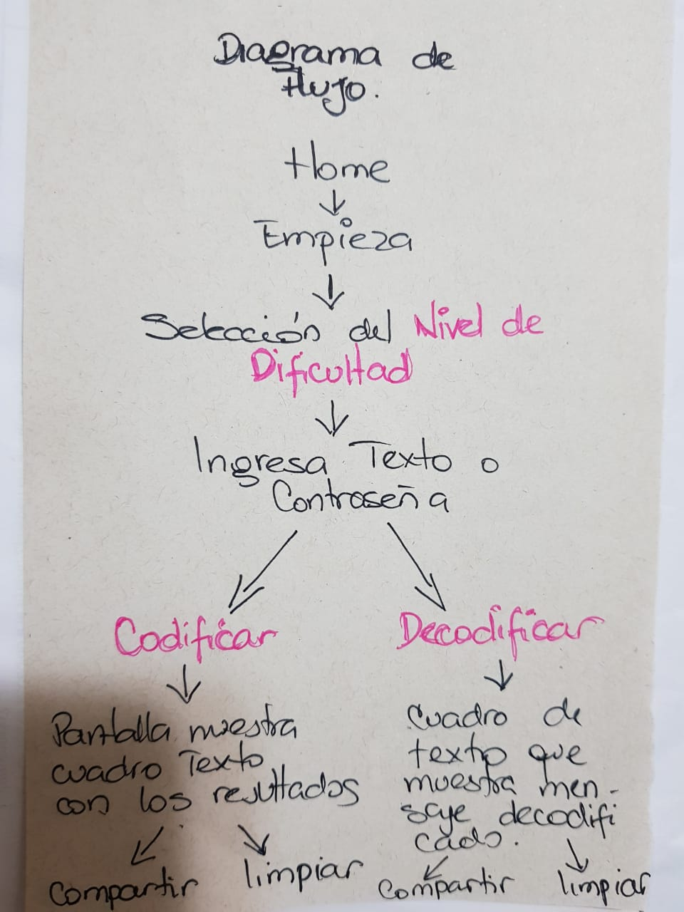
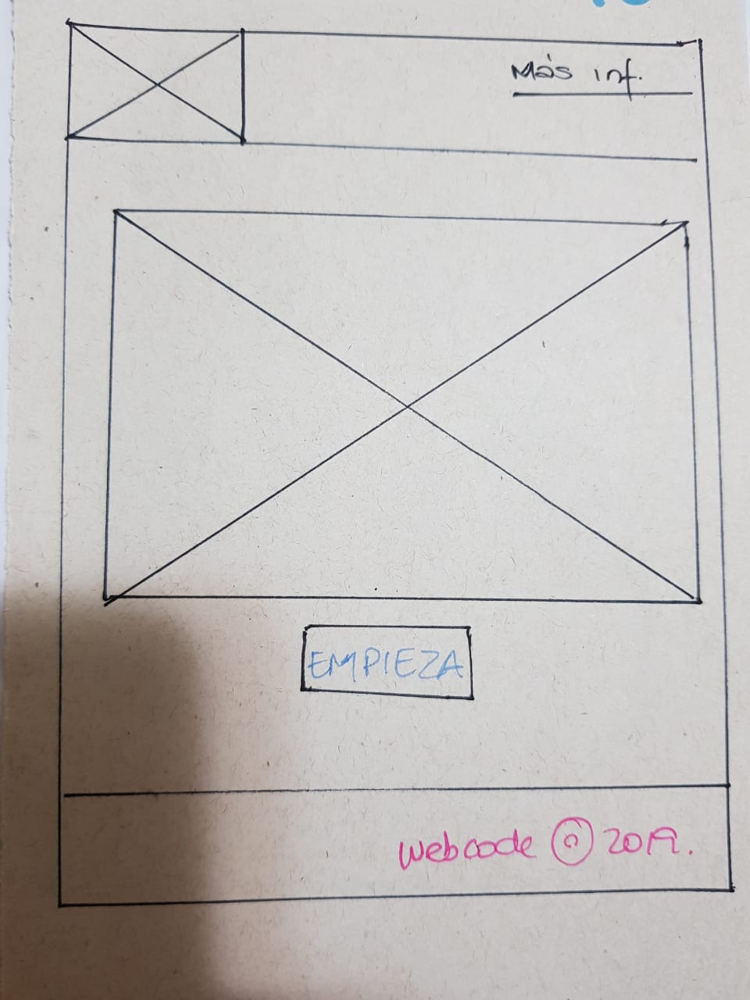
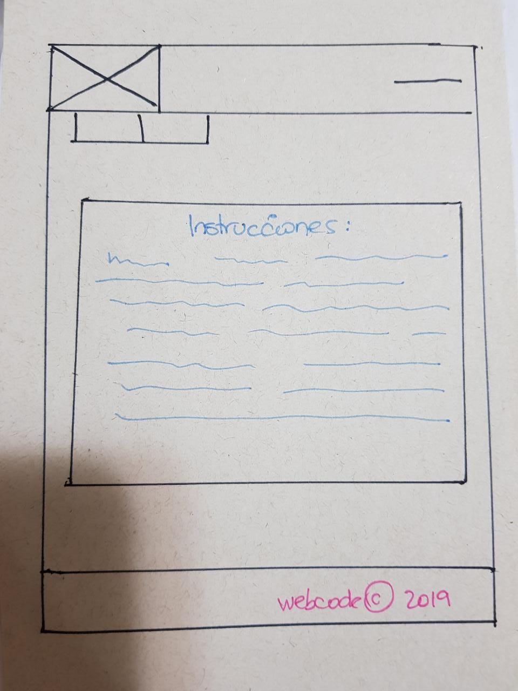
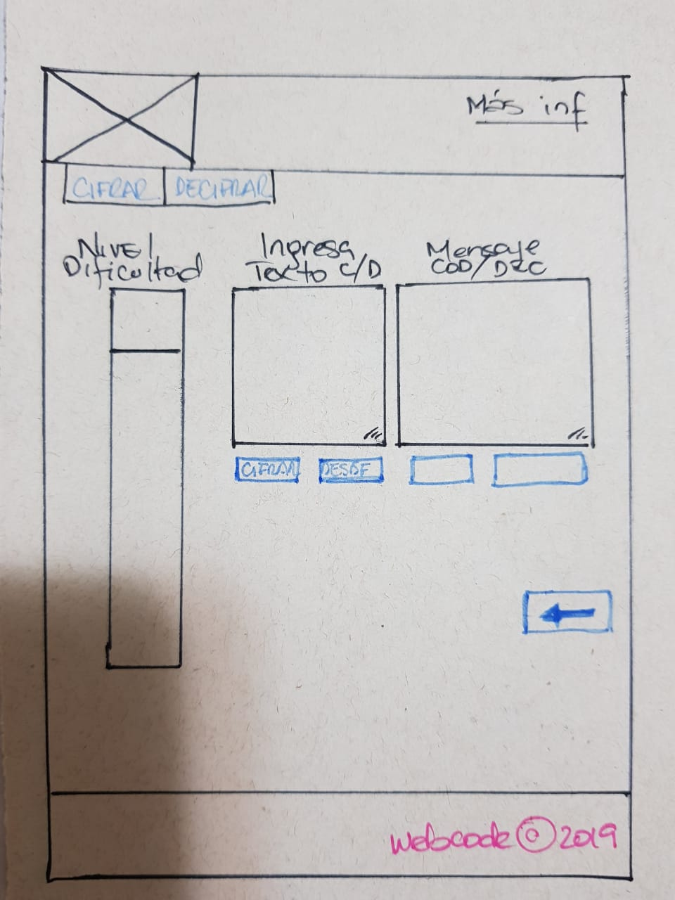
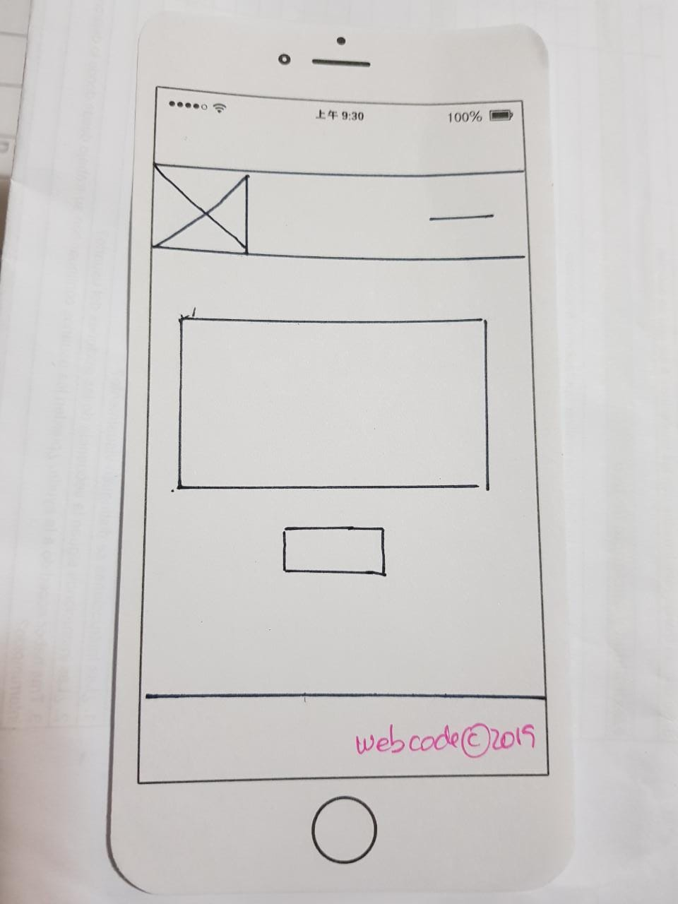
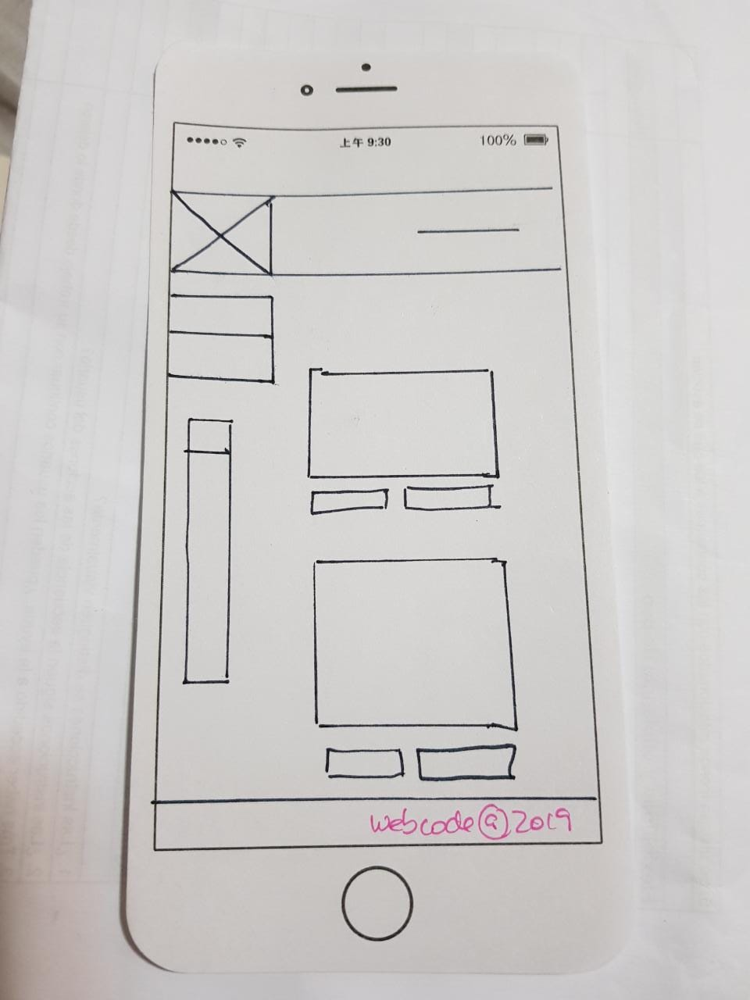
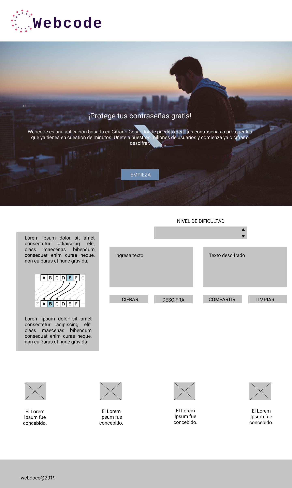

# Webcode 🖥

Webcode es una aplicación basada en Cifrado César, este modelo de cifrado es uno de los primeros métodos de cifrado conocidos. El emperador romano Julio César lo usaba para enviar órdenes secretas a sus generales en los campos de batalla. Con Webcode podŕas cifrar o descifar tus contraseñas en cuestion de segundos sin tener que correr el riesgo que estas estes vulnerables en su significado. 

En la actualidad, todos los cifrados de sustitución simple se descifran con mucha facilidad y, aunque en la práctica no ofrecen mucha seguridad en la comunicación por sí mismos; Webcode formar parte de sistemas más complejos de codificación que más que un resultado te brinda seguridad.

## Definición del producto y su relación con sus usuarios 📝 

Como todos sabemos para acceder a nuestras cuentas de las redes sociales necesitamos ingresar contraseñas o algun código que sólo nosotros sepamos. Webcode esta diseñado para todas aquellas personas activas en las redes sociales las cuales desean una aplicación que les permita asegurar sus contraseñas de manera tal, que puedan almacenarlas en cualquier lugar sin poner en riesgo la seguridad de estás.

Webcode te permite cifrar de manera sustitutiva donde una letra, número o carácter especial de un texto sea reemplazada por otra que se encuentra en una posición fija, para ellos sólo deberas elegir el nivel de dificultal que desees que tenga la misma y asi obtendras en nuevo texto.

Supongamos, que deseas encriptar tu contraseña del Facebook: Chimuelo23 

- Nivel de dificultad: 3
- Texto a cifra: Chimuelo23 
- Texto cifrado sera: Fklpxhor56

## ¿Cómo funciona Webcode? 🔍

El usuario de esta aplicación al ingresar tendra una breve información del producto mostrando de manaera muy visible un boton que le invita a EMPEZAR su operación al darle click a este accederá de manera inmediata a la sección donde podrá leer un poco más sobra las intrucciones de la aplicación, esta le indicará las opciones que tiene en cuanto letras, números y caracteres especiales y a recordarle que su cifrado será posible eligiendo un Nivel de dificultad. 

Al elegir su Nivel de dificultad tendra un recuadro donde podrá ingresar su información y seguido de esto dos botones visibles que le daran la opción de cifrar o descifra su mensaje según la elección o desición del mismo, obteniendo seguidamente su texto cifrado o descifrado. hemos creado un boton que le permitira limpiar ambas pantallas y asi iniciar una nueva operación si ese fuese su caso.

## Desiciones de Diseño 💡

#### Prototipos de Baja Fidelidad

#### Prototipos de Alta Fidelidad 🚀

Los colores en el marketing visual influyen en el resultado, comunican la esencia de una marca y hablan por el producto o servicio, no con palabras, si no con sensaciones y sentimientos.

Webcoded esta inspirada en colores azules y blanco. El azul es un color muy tipico de verlo en páginas web como Instagram, Facebook, Tumblr, Twitter y LinkedIn, redes sociales muy populares en la web, todas influyen sobre el crecimiento del tráfico web de forma exponencial y si observas todas ellas son azules.

El color en la web puede tener los siguientes efectos:

Incrementar el reconocimiento de marca hasta un 80%
Aumentar la lectura hasta un 40%
Acelerar el aprendizaje entre un 55% y un 78%
Incrementar la comprensión en un 73%
Los anuncios en color son leídos hasta un 42% más que los anuncios en blanco negro.
 
 AZUL
 Es considerado beneficioso para el cuerpo y la mente, retarda el metabolismo y tiene un efecto relajante. Es el color del cielo y del mar, es la opción natural cuando queremos que se vean las cosas sobre él, árboles, montañas, animales todos ellos destacan contra un fondo azul. Entre los significados que se le asocian están la profundidad, lealtad, sabiduría, calma y sinceridad. Está asociado a la estabilidad y la profundidad, es un color emocionalmente frío vinculado a la inteligencia y la consciencia.

 BLANCO
 El mundo publicitario lo ha asociado con la frescura dándole un significado de limpieza, se utiliza en fondos y en espacios negativos del diseño, generalmente para presentar productos novedosos y en campañas minimalistas.
 El color de la pureza, cuanto más puro mayor perfección transmite. Es el color del nacimiento, de la resurrección, de la paz. No posee connotaciones negativas, siendo un color positivo, estimulante, luminoso y delicado que transmite la castidad, la inocencia y la verdad.

 

 [enlace al prototipo de alta fidelidad Navegable](https://www.figma.com/proto/fKUJ9cehdNAyN5ut7VZEGnaO/Untitled?node-id=2%3A4&scaling=min-zoom&redirected=1)

 
 ### Planificación 📝
[enlace al tablero de Trello, indica planificación](https://trello.com/b/sXFbTOXz/cipher)

 ### Tests de Usabilidad 
 

 [videos test de usabilidad, Loom](https://www.useloom.com/share/21672cf25caa49888b16dffdf8bde3af)

 [videos test de usabilidad Drive](https://drive.google.com/drive/folders/1-JAVKBTfsIyL1kcPpgaCQivodGiCBDoT)

### Parte Obligatoria
* [X] `README.md` incluye info sobre proceso y decisiones de diseño.
* [X] `README.md` explica claramente quiénes son los usuarios y su relación con
  el producto.
* [X] `README.md` explica claramente cómo el producto soluciona los
  problemas/necesidades de los usuarios.
* [X] Usa VanillaJS.
* [X] No utiliza `this`.
* [X] Implementa `cipher.encode`.
* [X] Implementa `cipher.decode`.
* [X] Pasa linter con configuración provista.
* [X] Pasa pruebas unitarias.
* [X] Pruebas unitarias cubren 70% de _statements_, _functions_ y _lines_, y un
  mínimo del 50% de _branches_.
* [X] Interfaz permite elegir el `offset` o _desplazamiento_ a usar en el
  cifrado/descifrado.
* [X] Interfaz permite escribir un texto para ser cifrado.
* [X] Interfaz muestra el resultado del cifrado correctamente.
* [X] Interfaz permite escribir un texto para ser descifrado.
* [X] Interfaz muestra el resultado del descifrado correctamente.

### Parte Opcional: "Hacker edition"
* [X] Cifra/descifra minúsculas
* [ ] Cifra/descifra _otros_ caracteres (espacios, puntuación, `ñ`, `á`, ...)
* [X] Permite usar un `offset` negativo.

